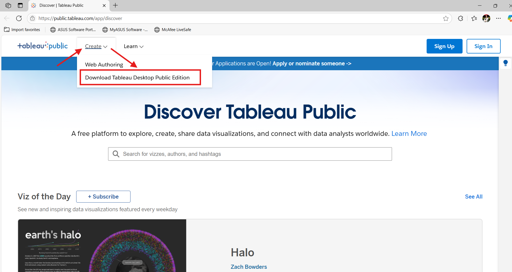

# Lab | Installing Tableau Public

We will be learning Tableau and you are going to need Tableau Public installed for this session. 

If you already have Tableau Public installed then you can skip this lab as it is an optional one.

## What is Tableau Public?

Tableau Public is a free version of Tableau that allows you to create interactive data visualizations and share them publicly online. It's perfect for learning data visualization concepts and building a portfolio of your work.

## System Requirements

### Windows
- Windows 10 or later (64-bit)
- Minimum 2 GB RAM (8 GB recommended)
- 15 GB available disk space
- Internet connection required

### Mac
- macOS 10.15 (Catalina) or later
- Minimum 2 GB RAM (8 GB recommended)  
- 15 GB available disk space
- Internet connection required

## Installation Instructions

### For Windows Users

1. Click on this [link](https://public.tableau.com/app/discover) to go to Tableau Public website
2. Click on `Create` then `Download Tableau Desktop Public Edition`
3. Fill out the registration form with your details
4. Once downloaded, run the installer (.exe file)
5. Follow the on-screen installation wizard:
   - Accept the license agreement
   - Choose installation location (default is recommended)
   - Click "Install" and wait for completion
6. Launch Tableau Public from your desktop or Start menu

### For Mac Users

1. Click on this [link](https://public.tableau.com/app/discover) to go to Tableau Public website
2. Click on `Create` then `Download Tableau Desktop Public Edition`
3. Fill out the registration form with your details
4. Once downloaded, open the .dmg file
5. Drag the Tableau Public application to your Applications folder
6. Launch Tableau Public from Applications or Spotlight search
7. If prompted about security, go to System Preferences > Security & Privacy and click "Open Anyway"

## Account Setup

1. When you first launch Tableau Public, you'll be prompted to create an account
2. You can use any email address (unlike PowerBI, Gmail and other public email services are accepted)
3. Choose a unique username as this will be part of your public profile URL
4. Verify your email address when prompted

## Important Notes

- **Public Nature**: Remember that all visualizations created with Tableau Public are publicly accessible online
- **Data Limitations**: Row limit of 15 million rows per data source
- **File Storage**: Workbooks are stored online in your Tableau Public profile
- **Offline Work**: You can work offline, but must be online to save and publish

## Troubleshooting

### Windows
- If installation fails, try running the installer as Administrator
- Disable antivirus temporarily during installation if needed
- Ensure Windows is up to date

### Mac
- If you get a security warning, go to System Preferences > Security & Privacy
- Make sure you have admin privileges on your Mac
- Try restarting your Mac if the application won't launch

## Resources

1. [Tableau Public Gallery](https://public.tableau.com/app/discover) - Explore visualizations created by the community
2. [Getting Started with Tableau Public](https://help.tableau.com/current/pro/desktop/en-us/getstarted_overview.htm) - Official documentation